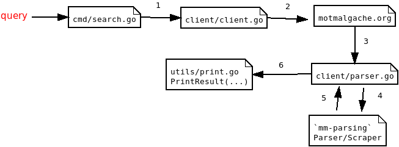

# ARCHITECTURE

Flow:
1. User query
2. HTTP request to *motmalgache.org*
3. HTML file is returned and handled by `client/parser.go`
4. HTML file is send to `mm-parsing` script
5. Parsing script return the data in JSON
6. `client/parser.go` convert the JSON to string and return the string
7. `PrintResult(...)` function print the final output
