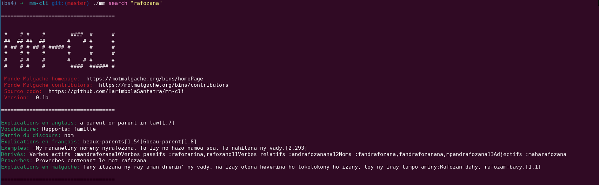

# MMCLI
**MMCLI** is a command line malagasy encyclopedia and dictionary. It uses [motmalgache.org][1] under the hood.

For a translator, see [translate-shell](https://github.com/soimort/translate-shell).

## Screenshot


## Setup
1. Setup a python virtual environment:
```
mkdir ~/.python-venv
python3 -m venv ~/.python-venv/bs4
source ~/.python-venv/bs4/bin/activate
python3 -m pip install -r requirements.txt
```

2. Build the executable:

```
make
```

3. Check if everything is right

```
./mm health
```

## Usage

View existing commands:

    ./mm help

```
A client for searching malagasy words, proverbs and misc

Usage:
  mm [flags]
  mm [command]

Available Commands:
  completion  Generate the autocompletion script for the specified shell
  health      Check health of motmalgache.org and the HTTP client
  help        Help about any command
  search      Search for a word
  version     Print version number

Flags:
  -h, --help   help for mm

Use "mm [command] --help" for more information about a command.
```

### Examples

- Search for a word: `./mm search "rafozana"`

## Acknowledgment
- Banner made with [ascii-banner](https://manytools.org/hacker-tools/ascii-banner/) - *Banner* font
- [Monde Malgache's contributors](https://motmalgache.org/bins/contributors)

[1]: https://motmalgache.org/bins/homePage
